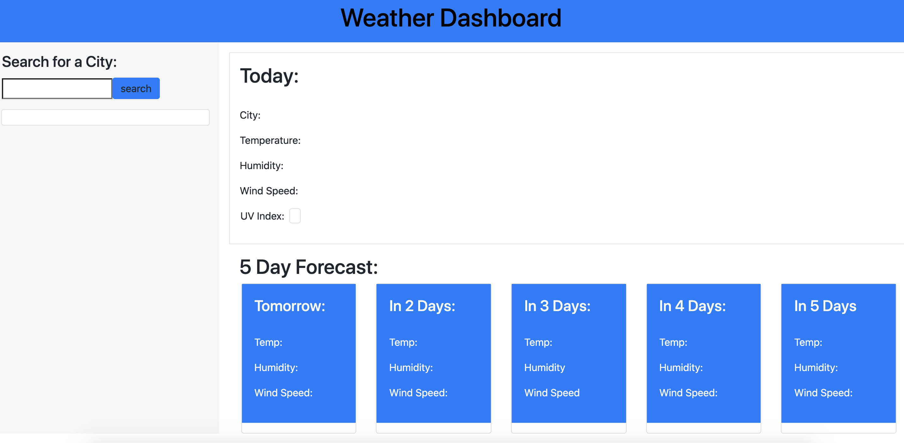

# Weather-Dashboard
The Weather Dashboard is an API-supplemented, bootstrap-styled, and jquery-powered web application designed to give basic weather update details of all the world's cities in real time as well as give averages for the next five following days. Users enter their city of choice and when the search button is clicked the application runs an AJAX call to retrieve the city's corresponding weather data and display it on the UI. 

Note from the author:
This is an unfinished application that will be revised in the near future. Due to time constraints the page lacks mutli-device responsiveness, and does not display dates or icons. Previously searched cities are locally stored but do not return on the page once another city is searched.

Deployed Link: https://bendrakeacker.github.io/Weather-Dashboard/

Repository Link: https://github.com/bendrakeacker/Weather-Dashboard